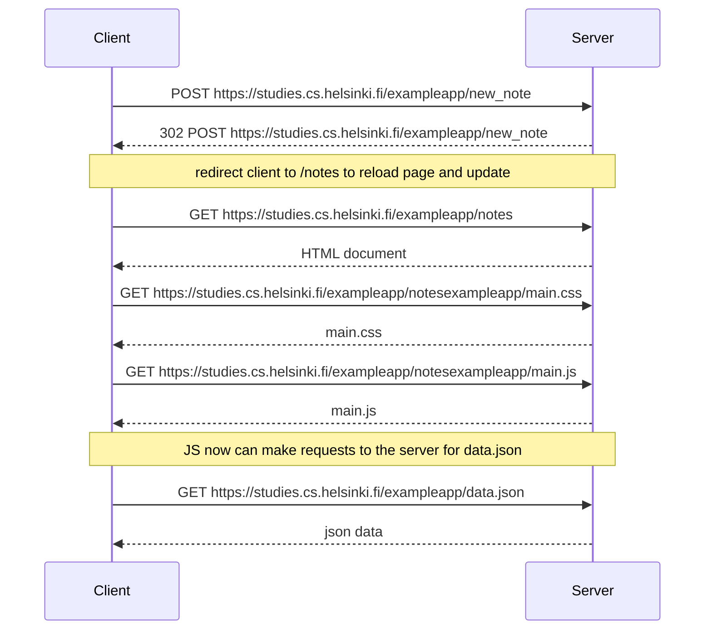

```mermaid
sequenceDiagram
    participant Client
    participant Server
    Client->>Server: POST https://studies.cs.helsinki.fi/exampleapp/new_note 
    Server-->>Client: 302 POST https://studies.cs.helsinki.fi/exampleapp/new_note
    Note over Client,Server: redirect client to /notes to reload page and update
    Client->>Server: GET https://studies.cs.helsinki.fi/exampleapp/notes
    Server-->>Client: HTML document
    Client->>Server: GET https://studies.cs.helsinki.fi/exampleapp/notesexampleapp/main.css
    Server-->>Client: main.css
    Client->>Server: GET https://studies.cs.helsinki.fi/exampleapp/notesexampleapp/main.js
    Server-->>Client: main.js
    Note over Client,Server: JS now can make requests to the server for data.json
    Client->>Server: GET https://studies.cs.helsinki.fi/exampleapp/data.json
    Server-->>Client: json data
```