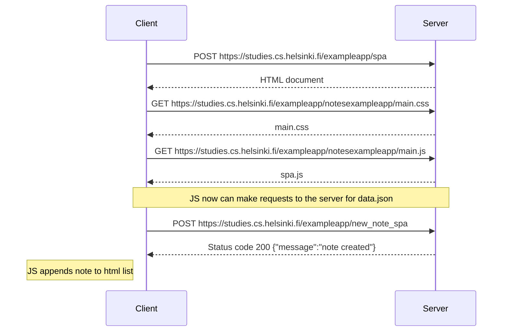

```mermaid
sequenceDiagram
    participant Client
    participant Server
    Client->>Server: POST https://studies.cs.helsinki.fi/exampleapp/spa
    Server-->>Client: HTML document
    Client->>Server: GET https://studies.cs.helsinki.fi/exampleapp/notesexampleapp/main.css
    Server-->>Client: main.css
    Client->>Server: GET https://studies.cs.helsinki.fi/exampleapp/notesexampleapp/main.js
    Server-->>Client: spa.js
    Note over Client,Server: JS now can make requests to the server for data.json
    Client->>Server: POST https://studies.cs.helsinki.fi/exampleapp/new_note_spa
    Server-->>Client: Status code 200 {"message":"note created"}
    Note left of Client: JS appends note to html list
```